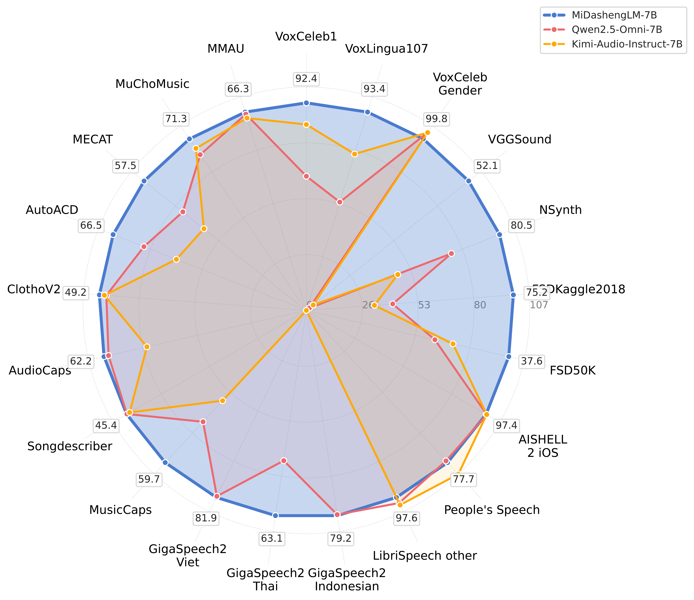
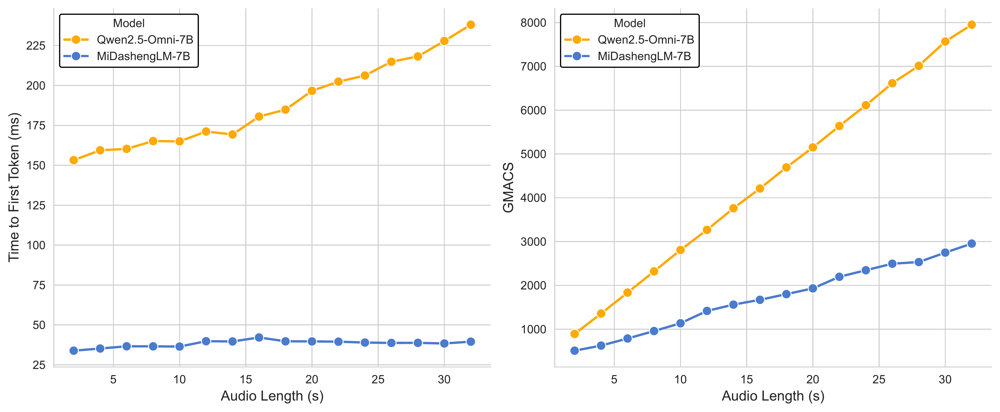

<div align="center">
    <h1>
    MiDashengLM-7B
    </h1>
    <b><em>Efficient audio understanding with general audio captions</em></b></em></b>
    <p>
    </p>
    <a href="https://arxiv.org/abs/2508.03983"></a>
    <a href="https://huggingface.co/models?search=midashenglm-7b"></a>
    <a href="https://modelscope.cn/models/midasheng/midashenglm-7b"></a>
    <a href="https://modelscope.cn/studios/midasheng/MiDashengLM-7B"></a>
    <a href="https://xiaomi-research.github.io/dasheng-lm/"></a>
    <a href="https://github.com/xiaomi-research/dasheng-lm/tree/main/mdl-toolkit"></a>
</div>

## 📢 News

- **2025-10-21**: Support instruction-following mode, enabling the model to follow human instructions in the audio. It plays a key role in building an audio question-answering assistant for efficient and natural interactions. The examples are in the [Gradio](https://modelscope.cn/studios/midasheng/MiDashengLM-7B).
- **2025-10-09**: Uploaded several newly [quantized model variants](https://github.com/xiaomi-research/dasheng-lm#available-model-variants) for resource-constrained devices.
- **2025-09-24**: Released the [mdl-toolkit](https://github.com/xiaomi-research/dasheng-lm/tree/main/mdl-toolkit), a user-friendly fine-tuning toolkit for MiDashengLM. ESC-50 example Notebook: [en](https://github.com/xiaomi-research/dasheng-lm/blob/main/mdl-toolkit/docs_en/esc-50.ipynb) | [中文](https://github.com/xiaomi-research/dasheng-lm/blob/main/mdl-toolkit/docs_zh/esc-50.ipynb)
- **2025-09-04**: vLLM now officially supports MiDashengLM. [Deploy dasheng-lm with vLLM](#deploy-with-vllm). And we're developing the 4-bit quantized version, please stay tuned.
- ​**2025-09-01**: vLLM integration PR submitted to the official vLLM repository. Preview available in our fork during review. See [Issue #17](https://github.com/xiaomi-research/dasheng-lm/issues/17#issuecomment-3241301450) for details.

## 🔥 Key Highlights

**State-of-the-Art Performance**
   - Outperforms Qwen2.5-Omni-7B, Kimi-Audio-Instruct-7B on **multiple key audio understanding tasks**.

**High Efficiency**
   - **3.2×** throughput speedup at comparable batch sizes compared to Qwen2.5-Omni-7B.
   - **20x** throughput speedup by increasing furhter batchsizes. We tested up to a **batch size=512** for 30s audio input on 80GB GPUs. Baselines only support batch size = 8.
   - Time-to-first-token (TTFT) speedup of up to **4x** compared to Qwen2.5-Omni-7B.

**Caption-based Alignment**
   - Trained with **general audio captions** (instead of ASR transcripts) to achieve holistic audio understanding.

**Full Transparency**
   - **Public-source** training data and reproducible pipeline.
   - Apache License 2.0 for **both research and commercial use**.

<div align="center">
    
</div>
<div align="center">
    <br>
    <sup>This 0804 version corresponds to the technical report. Newer version (1021) offers improved performance.</sup>
</div>

## Acknowledgment and Model Foundation

Although MiDashengLM demonstrates superior audio understanding performance and efficiency compared to Qwen2.5-Omni models,
we acknowledge **Qwen2.5-Omni as a remarkable and respected foundational work** in the field.
Our model specifically uses [Qwen2.5-Omni-7B Thinker](https://huggingface.co/Qwen/Qwen2.5-Omni-7B) as the initialization for decoder training, building upon its robust architecture and weight initialization.

The audio encoder is built upon [Dasheng](https://github.com/XiaoMi/dasheng), an open-source audio encoder for general audio understanding with state-of-the-art performance.
**Dasheng serves as the core foundation enabling MiDashengLM's exceptional performance**.

## Framework

MiDashengLM integrates the powerful Dasheng audio encoder with
the Qwen2.5-Omni-7B Thinker decoder through a unique caption-based alignment strategy.
Unlike conventional ASR-driven approaches,
our model leverages general audio captions to capture comprehensive audio representations encompassing speech, environmental sounds, and musical elements
in a unified textual format. This design enables holistic audio understanding while maintaining exceptional computational efficiency.


### Why Captions Instead of ASR?

ASR Limitations:
  - Discards huge amount of non-speech audio (music/environmental sounds).
  - Misses paralinguistic info (speaker emotion, acoustic properties).
  - Monotonic alignment provides trivial learning signal.

Caption Advantages:
  - Utilizes all audio content.
  - Captures global audio context.
  - Non-monotonic alignment provides a hard learning signal.

### Novel Open Source Dataset for Training: ACAVCaps

ACAVCaps is a meticulously curated 38,662-hour collection of general audio captions derived from the open-source [ACAV100M audio repository](https://acav100m.github.io/).
While leveraging ACAV100M's extensive raw audio materials, we completely re-engineered the annotation process to create a dataset for holistic audio understanding.
We devide the dataset into six categories:

| Category | Example Caption |
|----------|-----------------|
| Pure Speech | "A female voice narrates historical competition with synthetic modulation" |
| Pure Sound | "Outdoor scene with wind, birds, duck quacking and background noise" |
| Pure Music | "Crowd cheering with electronic synthesizer-driven soundscape" |
| Mixed Music | "The audio features a crowd cheering and clapping alongside electronic music with a synthesizer-driven, dark, and energetic soundscape." |
| Mixed Speech | "A Russian voice demonstrates a synthesizer’s capabilities over an experimental electronic backdrop, explaining its sound design and value in a gritty, vocal-fry tone." |
| Mixed Sound | "A man speaks in English about entering a city and village, accompanied by the sounds of a running vehicle." |

The figure below illustrates our data curation pipeline for ACAVCaps:


Each caption is generated through a three-step process:

1. **Multi-expert analysis** (speech, vocal, music, acoustics)
2. **LLM reasoning** synthesizing metadata with [DeepSeek-R1](https://github.com/deepseek-ai/DeepSeek-R1)
3. **Filtering** for audio-text consistency with [Dasheng-GLAP](https://github.com/xiaomi-research/dasheng-glap)

We will **release the ACAVCaps dataset** after the ICASSP 2026 review process.

## Available Model Variants

We provide multiple precision / quantization formats to cover different deployment and fine-tuning scenarios:

| Variant | Format | Hugging Face (1021) | ModelScope (1021) | Hugging Face (0804) | ModelScope (0804) |
|:-------:|:------:|:-------------------:|:-----------------:|:-------------------:|:-----------------:|
| midashenglm-7b | FP32 | [Link](https://huggingface.co/mispeech/midashenglm-7b-1021-fp32) | [Link](https://www.modelscope.cn/models/midasheng/midashenglm-7b-1021-fp32) | [Link](https://huggingface.co/mispeech/midashenglm-7b-0804-fp32) | [Link](https://www.modelscope.cn/models/midasheng/midashenglm-7b-0804-fp32) |
| midashenglm-7b-bf16 | BF16 | [Link](https://huggingface.co/mispeech/midashenglm-7b-1021-bf16) | [Link](https://www.modelscope.cn/models/midasheng/midashenglm-7b-1021-bf16) | [Link](https://huggingface.co/mispeech/midashenglm-7b-0804-bf16) | [Link](https://www.modelscope.cn/models/midasheng/midashenglm-7b-0804-bf16) |
| midashenglm-7b-fp8 | FP8 | [Link](https://huggingface.co/mispeech/midashenglm-7b-1021-fp8) | [Link](https://www.modelscope.cn/models/midasheng/midashenglm-7b-1021-fp8) | [Link](https://huggingface.co/mispeech/midashenglm-7b-0804-fp8) | [Link](https://www.modelscope.cn/models/midasheng/midashenglm-7b-0804-fp8) |
| midashenglm-7b-gptq-w4a16 | GPTQ W4A16 | [Link](https://huggingface.co/mispeech/midashenglm-7b-1021-w4a16-gptq) | [Link](https://www.modelscope.cn/models/midasheng/midashenglm-7b-1021-w4a16-gptq) | [Link](https://huggingface.co/mispeech/midashenglm-7b-0804-w4a16-gptq) | [Link](https://www.modelscope.cn/models/midasheng/midashenglm-7b-0804-w4a16-gptq) |

Usage Guidance:

* **FP32**: Use only when numerical precision is critical (e.g., for rigorous reproduction or benchmarking). For general use, it consumes more resources without a corresponding quality gain.
* **BF16**: Recommended for most general-purpose scenarios, including inference and fine-tuning. It delivers quality comparable to FP32 while being significantly faster on modern GPUs (e.g., A100, H100, RTX 4090).
* **FP8**: Optimized for Hopper-class (H100 and newer) GPUs, leveraging hardware support for enhanced performance and memory savings. While older GPUs may see limited performance gains, FP8 can still be used to conserve VRAM, and storage.
* **GPTQ W4A16**: An ideal choice for resource-constrained environments. It offers broad GPU compatibility and a smaller memory footprint, making it suitable for deployment where VRAM, memory, or storage is limited, provided that a slight trade-off in quality is acceptable.

The full list model variants of MiDashengLM: [Hugging Face](https://huggingface.co/models?search=midashenglm-) / [Model Scope](https://huggingface.co/models?search=midashenglm-)

## Usage

### Load Model

```python
from transformers import AutoModelForCausalLM, AutoProcessor, AutoTokenizer

model_id = "mispeech/midashenglm-7b-1021-bf16"

model = AutoModelForCausalLM.from_pretrained(model_id, trust_remote_code=True)
tokenizer = AutoTokenizer.from_pretrained(model_id, trust_remote_code=True)
processor = AutoProcessor.from_pretrained(model_id, trust_remote_code=True)
```

If you are in a region with limited access to Hugging Face resources, you may want to use [hf-mirror](https://hf-mirror.com/) as a mirror of Hugging Face:

```bash
export HF_ENDPOINT=https://hf-mirror.com
```

### Construct Prompt

```python
user_prompt = "Caption the audio."  # You may try any other prompt

messages = [
    {
        "role": "system",
        "content": [
            {"type": "text", "text": "You are a helpful language and speech assistant."}
        ],
    },
    {
        "role": "user",
        "content": [
            {"type": "text", "text": user_prompt},
            {
                "type": "audio",
                "path": "/path/to/example.wav",
                # or "url": "https://example.com/example.wav"
                # or "audio": np.random.randn(16000)
            },
        ],
    },
]
```

### Generate Output

```python
import torch

with torch.no_grad():
    model_inputs = processor.apply_chat_template(
        messages,
        tokenize=True,
        add_generation_prompt=True,
        add_special_tokens=True,
        return_dict=True,
    )
    generation = model.generate(**model_inputs)
    output = tokenizer.batch_decode(generation, skip_special_tokens=True)  # ["An engine is idling."]
```

### Fine-tuning

We appreciate the [ms-swift](https://github.com/modelscope/ms-swift) implementation contributed by [@JimmyMa99](https://github.com/JimmyMa99) in [ms-swift#5325](https://github.com/modelscope/ms-swift/pull/5325).

We also provide [**MDL-Toolkit**](./mdl-toolkit/README.md), a user-friendly fine-tuning toolkit for MiDashengLM.

### Deploy with vLLM

vLLM provides a high-performance, user-friendly library for LLM inference and serving.

Install vLLM with `pip` or [from source](https://docs.vllm.ai/en/latest/getting_started/installation/gpu/index.html#build-wheel-from-source):

```bash
# Set up using Python-only build (without compilation)
git clone https://github.com/vllm-project/vllm.git
cd vllm
VLLM_USE_PRECOMPILED=1 pip install --editable .

# Full build (with compilation)
git clone https://github.com/vllm-project/vllm.git
cd vllm
pip install -e .
```

You can find sample code for offline execution in the VLLM repository [audio_language](https://github.com/vllm-project/vllm/blob/51d5e9be7dbf4d914374447548dd01f9bfb68f89/examples/offline_inference/audio_language.py#L150).

```bash
# Offline inference
python3 examples/offline_inference/audio_language.py -m midashenglm

# Online serving using OpenAI-compatible server
python3 -m vllm.entrypoints.openai.api_server --model mispeech/midashenglm-7b --tensor-parallel-size 1 --served-model-name default --port 8000 --dtype float16 --max_model_len 4096 --trust_remote_code
```

✨ **Coming Soon**
We're currently developing **4-bit quantized versions**.

## Results

The [technical report](https://arxiv.org/abs/2508.03983) primarily evaluates the [midashenglm-7b-0804-fp32](https://huggingface.co/mispeech/midashenglm-7b-0804-fp32) model, which represents our initial release from August 4, 2025. Note that our current best-performing model is [midashenglm-7b-1021](https://huggingface.co/models?search=midashenglm-7b-1021), though the technical report has not been updated to include its results. For detailed experimental tables and performance metrics, please refer to the [Hugging Face model pages](https://huggingface.co/models?search=midashenglm-7b) or the technical report.

### Reproduction Instructions

To reproduce our results, we provide:

- Prompts ([prompt.csv](evaluate/prompt.csv))
- Evaluation scripts
- Example JSONL files

#### 1. Install Dependencies for Evaluation (No need this for inference)

```bash
pip install -r requirements.txt
```

#### 2. Generate Model Outputs

Generate responses using the model's official framework with prompts from [prompt.csv](evaluate/prompt.csv).

#### 3. Convert Outputs to JSONL Format

Format model outputs using the [example JSONL](evaluate/jsonl) files:

| Task | Example File |
|------|--------------|
| Automatic Speech Recognition | [MiDashengLM_LibriSpeech_test-clean.jsonl](evaluate/jsonl/MiDashengLM_LibriSpeech_test-clean.jsonl) |
| Single-target Audio Tagging | [MiDashengLM_NSynth.jsonl](evaluate/jsonl/MiDashengLM_NSynth.jsonl) |
| Gender Recognition | [MiDashengLM_VoxCeleb-Gender.jsonl](evaluate/jsonl/MiDashengLM_VoxCeleb-Gender.jsonl) |
| Multi-target Audio Tagging | [MiDashengLM_FSD50K.jsonl](evaluate/jsonl/MiDashengLM_FSD50K.jsonl) |
| Audio Captioning | [MiDashengLM_AutoACD.jsonl](evaluate/jsonl/MiDashengLM_AutoACD.jsonl) |
| Open Audio Question Answering | [MiDashengLM_MusicQA.jsonl](evaluate/jsonl/MiDashengLM_MusicQA.jsonl) |
| Audio QA with Options | [MiDashengLM_MuChoMusic.jsonl](evaluate/jsonl/MiDashengLM_MuChoMusic.jsonl) |

#### 4. Evaluate Results

Execute the corresponding evaluation scripts:

```bash
# Automatic Speech Recognition (WER)
# Uses: lang, text, model_output
python evaluate/wer/compute_wer.py -i evaluate/jsonl/MiDashengLM_LibriSpeech_test-clean.jsonl

# Single-target Audio Tagging (ACC)
# Uses: label, model_output
python evaluate/compute_at_acc.py -i evaluate/jsonl/MiDashengLM_NSynth.jsonl

# Gender Recognition (ACC)
# Uses: label, model_output
python evaluate/compute_gender_acc.py -i evaluate/jsonl/MiDashengLM_VoxCeleb-Gender.jsonl

# Multi-target Audio Tagging (mAP)
# Uses: dataset_name, label, model_output, model_name
python evaluate/compute_map.py -i evaluate/jsonl/MiDashengLM_FSD50K.jsonl

# Audio Captioning (FENSE)
# Uses: audio, text, model_output
python evaluate/compute_fense.py -i evaluate/jsonl/MiDashengLM_AutoACD.jsonl

# Open Audio QA (FENSE)
# Uses: audio, answer, model_output
python evaluate/compute_fense.py -i evaluate/jsonl/MiDashengLM_MusicQA.jsonl

# Audio QA with Options (ACC)
# Uses: answer, model_output
python evaluate/compute_qa_acc.py -i evaluate/jsonl/MiDashengLM_MuChoMusic.jsonl
```

#### 5. Evaluate on MECAT and MMAU benchmarks

Please refer to the official repositories for evaluation on the [MECAT](https://github.com/xiaomi-research/mecat)
and [MMAU](https://github.com/Sakshi113/mmau) benchmarks.

## Efficiency

MiDashengLM-7B demonstrates superior inference efficiency compared to Qwen2.5-Omni-7B,
achieving 3.2× speedup at comparable batch sizes and an overall potential speedup of 20.2× with larger batches.



| Batch Size | MiDashengLM-7B (samples/s) | Qwen2.5-Omni-7B (samples/s) | Speedup |
|:----------:|:-----------------------:|:----------------------------:|:-------:|
| 1          | 0.45                    | 0.36                         | 1.25x   |
| 4          | 1.40                    | 0.91                         | 1.53x   |
| 8          | 2.72                    | 1.15                         | 2.36x   |
| 16         | 5.18                    | OOM                          | -       |
| 32         | 9.78                    | OOM                          | -       |
| 64         | 17.07                   | OOM                          | -       |
| 128        | 22.73                   | OOM                          | -       |
| 200        | 25.15                   | OOM                          | -       |

*Tested on 80GB GPU with 30s audio, 100-token output.*

## Citation

MiDashengLM is under the Apache License 2.0, and we encourage its use in **both research and business applications**.

If you find MiDashengLM useful in your research, please consider citing our work:

```bibtex
@techreport{midashenglm7b,
  title      = {MiDashengLM: Efficient Audio Understanding with General Audio Captions},
  author     = {{Horizon Team, MiLM Plus}},
  institution= {Xiaomi Inc.},
  year       = {2025},
  note       = {Contributors: Heinrich Dinkel et al. (listed alphabetically in Appendix B)},
  url        = {https://arxiv.org/abs/2508.03983},
  eprint     = {2508.03983},
}
```
